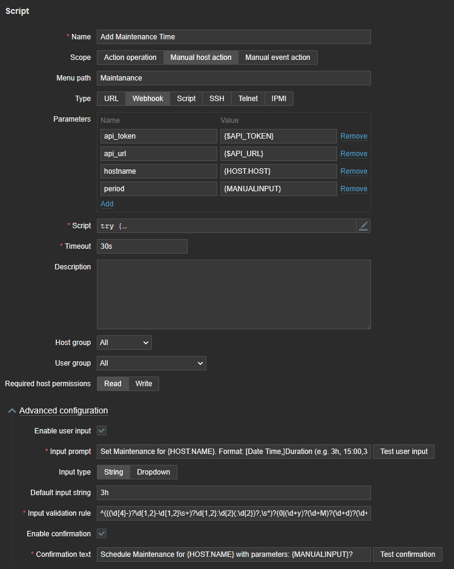
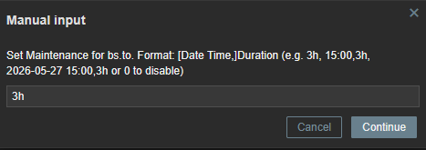

# Zabbix Manual Action Add Maintenance Time

This script is designed to manage maintenance periods for a specific host in Zabbix via the manual host action feature in Zabbix 7.0.  
It creates or updates a maintenance window for a given host using a user-specified duration (e.g., `1h30m`), and **can now also schedule maintenance windows in the future** by specifying a start time and date.

It handles the following logic:

- If the user inputs a period > 0 (with or without a specific start time), the script either creates a new maintenance or updates an existing maintenance that matches the name pattern `Script Maintenance Host: <hostname>`.
- If the user inputs `0`, the script will remove an existing script-managed maintenance (if present).
- If no script-managed maintenance is found and the period is `0`, nothing is done.
- If the specified maintenance duration is shorter than 600 seconds, it will be set to 600 seconds to comply with Zabbix's minimum period requirement.
- If a start time is provided without a date, and that time has already passed today, the script automatically schedules the maintenance for the next day.
- The maintenance is created or updated to apply to a single host only, ensuring existing maintenances for other hosts or other custom maintenances remain unaffected.
- The description field of the maintenance is automatically updated to show the exact start and end times.

## Requirements

- Zabbix 7.0 or higher (due to the added feature to enter manual input).
- A valid Zabbix API token and URL (passed via `api_token` and `api_url`).
- A hostname (`hostname`) of an existing host in Zabbix.
- A period input string (`period`) that can optionally contain a start date/time, followed by a duration. Supported duration units: `y`, `M`, `d`, `h`, `m`, `s`.  
  Examples: `3h`, `15:00,3h`, `2026-05-27 15:00,2h30m`, `0` (for removal).

## Installation

1. Navigate to **Alerts -> Scripts** in the Zabbix UI (Zabbix 7.0).
2. Create a new script with the following parameters:

   - **Name:** Add Maintenance Time  
   - **Scope:** Manual host action  
   - **Menu path:** Maintenance  
   - **Type:** Webhook

   **Parameters:**
   - `api_token = {$API_TOKEN}` (a global User Macro storing your Zabbix API Token)
   - `api_url = {$API_URL}` (a global User Macro storing your Zabbix API URL)
   - `hostname = {HOST.HOST}`
   - `period = {MANUALINPUT}`

   **Script:** Paste the entire JavaScript code into the Script field.

   **Advanced configuration:**
   - Enable user input: **Enabled**
   - Input prompt: `Set Maintenance for {HOST.NAME}. Format: [Date Time,]Duration (e.g. 3h, 15:00,3h, 2026-05-27 15:00,3h or 0 to disable)`
   - Input type: String
   - Default input string: `3h`
   - Input validation rule: `^(((\d{4}-)?\d{1,2}-\d{1,2}\s+)?\d{1,2}:\d{2}(:\d{2})?,\s*)?(0|(\d+y)?(\d+M)?(\d+d)?(\d+h)?(\d+m)?(\d+s)?)$`
   - Enable confirmation: **Enabled**
   - Confirmation text: `Schedule Maintenance for {HOST.NAME} with parameters: {MANUALINPUT}?`

3. Make sure your `{$API_TOKEN}` and `{$API_URL}` macros are correctly set up in Zabbix:
   - `{$API_URL}` should point to your Zabbix frontend’s API endpoint (e.g. `https://zabbix.example.com/api_jsonrpc.php`).
   - `{$API_TOKEN}` should be a valid API token created in Zabbix (Users -> API tokens).

4. Once saved, navigate to a host in the Zabbix UI, click on the dropdown menu in the top-right corner (Action menu), select the "Maintenance" path, and choose "Add Maintenance Time".  
   Provide a time period and/or start time (e.g., `15:00,2h`), confirm, and the script will create or update the maintenance accordingly.

## How it Works

- The script parses the user input (`period`). It can handle just a duration (e.g., `3h`) or a start time/date combined with a duration (e.g., `15:00,3h`).
- It calculates the start time (`active_since`) and end time (`active_till`) based on the input. 
- **Smart Scheduling:** If the user provides a time (e.g., `15:00`) that has already passed for the current day, the script intelligently shifts the start time to the next day (+24 hours). Explicit dates are respected exactly as entered.
- If `period > 0`, it checks if a matching script maintenance already exists:
  - If yes, it updates the existing maintenance with the new timeframe.
  - If no, it creates a new maintenance named `Script Maintenance Host: <hostname>`.
- If `period = 0`, it tries to delete the existing script maintenance. If none found, it does nothing.
- If the requested duration is less than 600 seconds (minimum required by Zabbix), it is automatically raised to 600 seconds.
- The script sets a description indicating the exact `From:` and `Until:` timestamps for clear visibility in the Zabbix UI.

## Example Usages

- **Immediate Maintenance:**
  - Entering `2h` sets a 2-hour maintenance starting right now.
  - Entering `10m` sets a 10-minute maintenance (if less than 600 seconds, it automatically becomes 600 seconds).
- **Scheduled Maintenance:**
  - Entering `15:00,3h` schedules a 3-hour maintenance starting at 15:00 today (or tomorrow, if 15:00 has already passed).
  - Entering `05-27 15:00,4h` schedules a 4-hour maintenance on May 27th of the current year.
  - Entering `2026-05-27 15:00:00,2d` schedules a 2-day maintenance starting on the exact given date and time.
- **Removal:**
  - Entering `0` removes the existing script maintenance, if any.

## Troubleshooting

- Make sure you have correct values for `{$API_TOKEN}` and `{$API_URL}`.
- Ensure the "EnableGlobalScripts" parameter in the Zabbix server config is enabled (`1`).
- If you encounter input validation errors, ensure your input strictly follows the format, or relax the `Input validation rule` in the script configuration to `^[a-zA-Z0-9:,-\s]+$`.
- Check the Zabbix server logs for script execution details if something unexpected happens.
